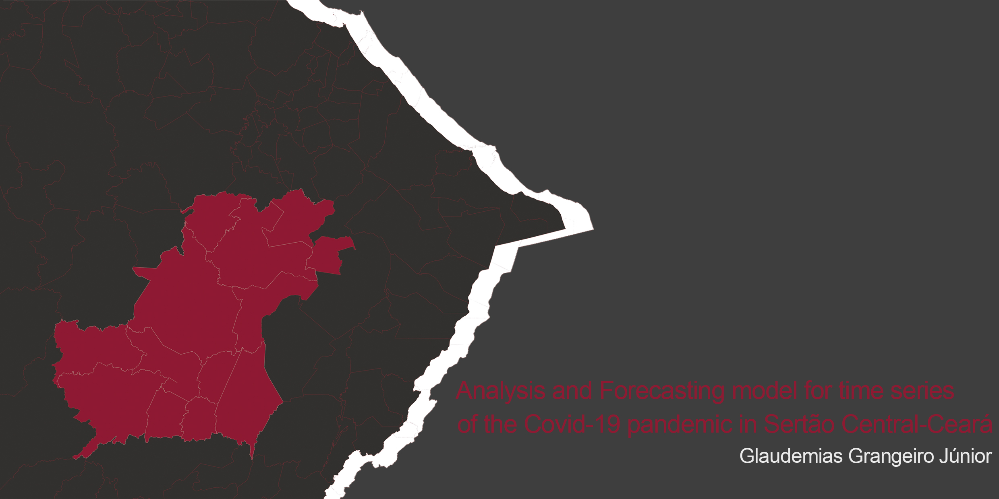

# PROJECT - ANALYSIS AND FORECASTING MODEL OF COVID DATA - IN SERTÃO CENTRAL,CE

 

  

# Contents
* Introduction
* Data
* Methodology
* Tooling
* Concluisions
* Acknowledgments
* References

# Introduction

This project is the result of module 3, of the Bootcamp in Data Science applied (second edition) proposed by Alura and apoint to some analysis about the numbers of covid-19 in brazilian state Ceará, specifically in the Sertão Central region, from 2020 to 2021(25/07/2021). Furthermore it was proposed one forecast model for temporal series, usign the two most affected cities of the region. These [data](#dt) are available in the official [Covid-19 website of Brazilian government](https://covid.saude.gov.br/)
  
Based on this my anilisys divides into 3 parts, and you can uderstand more the logic, in the [methodology](#mt) explanation
  
## COVID-19 in Brazil and Ceará
  
  The first case of covid-19 in Brazil it was registered in 02/06/2020, and it's found in São Paulo, seven days later 25 new cases are confirmed by the Brazilian Government Health Ministry, in six new states, they are: **Espirito Santo, Rio de Janeiro, Alagoas, Bahia, Minas Gerais e Distrito Federal**. The Covid-19 pandemic, in Brazil it has been an unprecedented catastrophe, the number of cases and deaths it was growing up so fast, every single week. For example six mounths later the first case in the country, Brazil registered 100.000 death (in 08/08/2020), in 01/07/2021 this number doubles. Currently Brazil has surpassed the worrying hal-million mark of cases, and in 07/04/2021 has reached 18 millions of deaths. This numbers make Brasil  the most affected country in Latin America.
  
  One of the most affected states of the country was Ceará, on March 15 of 2020 the state confirmed the three first cases in the city of Fortaleza, in the same place, was confirmed the first death on the March 26 of that year. In this date the state Ceará registered 211 new cases, distribuited in the following cities: **Aquiraz(6), Sobral(4), Fortim(1), Mauriti(1) and Juazeiro do Norte (1)**. In the April 8 of that year, Ceará was considered one of the most worrying States, as it had a 100% ICU occupancy rate, and 50% of cases above average rate.
  
 

 
  On 05/07/2020 Ceará was collapsed the health system, and in the same date ranks the 3rd as the state most affected by the pandemic, with numbers of cases in 71.402 and 4.480 number of deaths, made Ceará the state with more deaths than China (the first epicenter of de pandemic in the world).In the same date, [the presiden of Brazil encourages people to invade public hospitals to verify if the emergency beds were free our occupied](https://oglobo.globo.com/epoca/sociedade/ele-esta-incentivando-baderna-desabafo-de-enfermeira-apos-bolsonaro-pedir-que-seguidores-invadam-hospitais-24477843) 
  
  Seeking ways to get out of the situation, the state goverment implemented in 05/08/2020 the first social distance measures and lockdown and since then, the measures have became common. This affected the numbers, as more recent information indicates that avareges of deaths for Covid-19 in Ceará, on 06/28/2021, was the second lowest avarage since 2020. Howerever Brasil still onde of the most affected country for the pandemic, and the situation of Ceará is critical. The State registered more than 700.000 cases, and 18.000 numbers of deaths, and the according to the report in [Diário do Nordeste](https://diariodonordeste.verdesmares.com.br/regiao/todas-as-regioes-do-ceara-apresentaram-mais-mortes-por-covid-19-em-2021-que-2020-exceto-a-de-sobral-1.3096088), every region in Ceará have more death for Covid-19 in 2021 than 2020

## The Sertão Central Region
  The Ceará States was divide in 14 planning regions, namely:
- Cariri Planning Region;
- Centro Sul Planning Region;
- Grande Fortaleza/Região Metropolitana Planning Region;
- Litoral Leste Planning Region;
- Litoral Norte Planning Region;
- Litoral Oeste / Vale do Curu Planning Region;
- Maciço de Baturité Planning Region;
- Serra da Ibiapaba Planning Region;
- Sertão Central Planning Region;
- Sertão de Canindé Planning Region;
- Sertão de Sobral Planning Region;
- Sertão dos Crateú Planning Region;
- Sertão dos Inhamuns Planning Region;
- Vale do Jaguaribe Planning Region.
 
 

 
 My analysis was first loocking to all regions, but in the last part focused in the Sertão Central Planning Region. The Sertão Central Region, it's a territory that covers 15.678,4 km², and composed by the following cities: **Banabuiú, Choró, Quixadá, Quixeramobim, Deputado Irapuan Pinheiro, Ibaretama, Milhã, Mombaça, Pedra Branca, Piquet Carneiro, Senador Pompeu e Solonópole**.
 
In the past, the region for long time was survived having the cotton plattantion as the main economic activitie, but nowadasy the region stands out for the offer services like health (as in the case of the Regional Hospitall of Sertão Central localizated in Quixeramobim) and educations services, with the numerous colleges located in Quixadá 
   

    
# Data

The data used in this analysis was obtained from the [official Covid-19 website of Brazilian government](https://covid.saude.gov.br/). You can find the data , and shapefiles of the state[here](https://github.com/Glaudemias/Projeto_COVID_Sertao_CENTRAL/tree/main/Data) on my repositorie. The datasets have the folloeing informations:
  
 * **região:** Regions of the country and the accumulated numbers reffering to the country, the values foundind, was: *Brasil, Norte, Nordeste, Sul, Sudeste e Centro-Oeste*. 

* **estado:** This column have the Federation Unity. The values are the 27 Federations Unitys.

* **municipio:** This column have the all name of cities in Brazil.

* **coduf:** This colum have the code number of each Federation Unity.

* **codmun:** This colum have the code number of all cities in Brazil.

>> **Região de Saúde**
The health regions are a geographic space, made by the group of cities, that share some cultural identities, socialeconomics and a same comunication or transport network. They have the purpose to integrate the organization, and the planning of action and health services.
  
* **codRegiaoSaude:**  The column have the code number of each health region.

* **nomeRegiaoSaude:** The column have the name of all health region.

* **data:** date referring to a new case or new death. 
  
* **semanaEpi:** Epidemic Week regarding notification.

* **populacaoTCU2019:** The stimate number of  population in 2019, for every city in Brazil.

* **casosAcumulado:** The total number of cases on a specific date.

* **casosNovos:** The number of new cases on a specific date.

* **obitosAcumulado:** The total number of deaths on a specific date.

* **obitosNovos:** The number of new deaths on a specific date.

* **Recuperadosnovos:** The total number of cases retrieved on a specific date.

* **emAcompanhamentoNovos:** The total number of cases under observation on a specific date

* **interior/metropolitana:** Indicate if the localization of the information was 
characterized in Rural áreas(value 0) or metropolitan region (value 1)
  
A complementary description of each columns in dataset is also provided in the Covid-19 website, you can find [here](https://covid.saude.gov.br/)
 
   
# Methodology
These project was divided in 3 parts. 

1. [The first part](https://github.com/Glaudemias/Projeto_COVID_Sertao_CENTRAL/blob/main/Notebooks/PROJETO_PARTE_1.ipynb), it's the treatment of datasets, and information filtering about the state of Ceará. This part it's result in some dataframes divide in two groups (geodataframe and dataframe);
2. [The second part](https://github.com/Glaudemias/Projeto_COVID_Sertao_CENTRAL/blob/main/Notebooks/PROJETO_PARTE_2_.ipynb), it's a visualization of data about Covid-19 cases in Ceará regions, comparing Sertão Central with other regions, seeking to visualize the most affected region, and the postion of Sertão Central in the ranking;
3. [The third part](https://github.com/Glaudemias/Projeto_COVID_Sertao_CENTRAL/blob/main/Notebooks/PROJETO_PARTE_3_.ipynb), it's focused in the cities of Sertão Central, and in this part I made analysis about the effect of covid - 19 in the region, and made a forecast model based in the two most affected cities.
With this we were able to made some conclusions about the variables observerd, you cand find them in the [Conclusion](#concl)

# Tooling (Libraries and Technology)
This project are made in the python 3.8.5, used the Collab the cloud storage services of google, Google Collaboratory.The libraries used here, were:

* Pandas, the main librarie of data analysis in Python, used to manipulate and help in statiscal conclusion about the datasets;
* Numpy, used to made mathematical simulations;
* Sklearn, used to test the forescast model using  mathematical metrics;
* StatsModels, used to underrstand the crosscorrelation betwenn 2 informations;
* Prophet, used to make a time series forecast model  
* Seabornd,Matplotlib.pyplot, for plotting of the charts;
* Geopandas, for plotting the map.

# Conclusion
  
After this analysis, I have found some conclusions:

First, its clear how the pandemic affected all Ceará, principally the urbanized regions. Another pointed to be noted its the growth of cases in 2020 to 2021.
  
Conclusions about the regions:
* The 3 regions most affected by the Covid-19 was Região Metropolitana, Cariri, Sertão de Sobral, in this order.This fact can be explained, by the fact the all 3 regions have large urban centers (Fortaleza, Juazeiro do Norte e Sobral), and that centers atrracted a lot of people, because they offer services related to, work, healt system, education system, etc.
* Even being located in the center of the state, the Sertão Central region don't have more numbers of cases than interior regions like Centro-Sul, Sertão dos Inhamus and Vale do Jaguaribe. But the region have more numbers of deaths than numbers of cases, when compare to these regions
Conclusions about the cities:
* Quixadá and Quixeramobim are the most affected cities of the Sertão Central, and Quixeramobim have more numbers of deaths than Quixadá. The explication its very inconclusive, but i belive that was related to fact of Quixeramobim is the localization of the Regional Hospital of Sertão Central, and this place serves to all cities of the regions.
* Deputado Irapuã Pinheiro are the least affected city
* The most critical datas of the covid in the regions and cities was 05/2020 - 07/2020 and 2021/03 - 2021-06(the limit of days in the dataset). The 2020 dates, was the same when the all states has became the 3rd most affected state in the country
* The 2021 year, have almost 50% more cases and deaths than 2020
* Even with the start of vaccination, the forecast model have demonstrate that curve continues grown, and this fact could be related to the way of Brazil have been treating the vaccination of the population.
*In the weekly seasonality of the forescast model, there was a low on weekends and on mondays(probably because it was affected by the sunday)
* Quixadá forecast model have a better performance than Quixeramobim.
  
## To advance in the analisys 

* One good idea, would be to improve the Quixeramobim forecast model

# Acknowledgments
This project as said before, was proposed as a second project in the Alura's Bootcamp, as an introduction to the Data Science world. 
 
So I'm gonna say thank you, and welcome to the new teachers: Allan and Karol :). Thank so much for all the knowledge passed on to the students. Thank's to ScubaTeam and all the comunity it was created on the discord, specially Filipe, Carol and Valquiria, you guys contributed a lot to this project and were always willing to help with my questions.

A SPECIAL thanks to my dear friends Stephane and Erick, thanks for supporting me 
    
THANK YOU!! :)
 

# References
[01] - [Article 1](https://diariodonordeste.verdesmares.com.br/regiao/todas-as-regioes-do-ceara-apresentaram-mais-mortes-por-covid-19-em-2021-que-2020-exceto-a-de-sobral-1.3096088) - *Todas as regiões do Ceará apresentaram mais mortes por Covid-19 em 2021 que 2020, exceto a de Sobral*

[02] - [Article 2](https://diariodonordeste.verdesmares.com.br/regiao/oros-implanta-medidas-restritivas-para-conter-covid-19-veda-aulas-presenciais-e-pontos-turisticos-1.3078419) - *Orós implanta medidas restritivas para conter Covid-19, veda aulas presenciais e pontos turísticos*

[03] - [Article 3](https://diariodonordeste.verdesmares.com.br/regiao/ico-tem-100-de-leitos-de-uti-lotados-desde-inicio-de-maio-1.3093287) - *Icó tem 100% de leitos de UTI lotados desde início de maio*

[04] - [Article 4](https://covidreference.com/timeline_pt) - *Linha do Tempo Covid-19 no mundo*

[05] - [Article 5](https://www.otempo.com.br/interessa/primeiro-caso-de-coronavirus-fora-da-asia-e-registrado-nos-eua-1.2287219) - *Primeiro caso de coronavírus fora da Ásia é registrado nos EUA*

[06] - [Article 6](https://g1.globo.com/ciencia-e-saude/noticia/2020/02/15/primeira-morte-ligada-ao-coronavirus-fora-da-asia-e-confirmada-na-franca.ghtml) - *Primeira morte ligada ao coronavírus fora da Ásia é confirmada na França*

[07] - [Article 7](https://g1.globo.com/sp/sao-paulo/noticia/2020/08/26/primeiro-caso-confirmado-de-covid-19-no-brasil-ocorreu-em-sp-e-completa-seis-meses-nesta-quarta.ghtml) - *Primeiro caso confirmado de Covid-19 no Brasil ocorreu em SP e completa seis meses nesta quarta*

[08] - [Article 8](https://www.conjur.com.br/2021-jan-13/bolsonaro-tentou-sabotar-combate-coronavirus-ong) - *Bolsonaro tentou sabotar combate ao coronavírus, diz Human Rights Watch*

[09] - [Article 9](https://www.uol.com.br/vivabem/noticias/agencia-estado/2021/06/22/preco-que-o-governo-pagou-por-vacina-indiana-covaxin-foi-1000-mais-alto.htm) - *Preço que o governo pagou por vacina indiana Covaxin foi 1000% mais alto*

[10] -[Article 10](https://g1.globo.com/ce/ceara/noticia/2020/03/15/tres-primeiros-casos-de-coronavirus-no-ceara-sao-confirmados-pela-secretaria-da-saude.ghtml) - *Três primeiros casos de coronavírus no Ceará são confirmados pela Secretaria da Saúde*

[11] - [Article 11](https://oglobo.globo.com/epoca/sociedade/ele-esta-incentivando-baderna-desabafo-de-enfermeira-apos-bolsonaro-pedir-que-seguidores-invadam-hospitais-24477843) - *'Ele está incentivando a baderna': o desabafo de enfermeira após Bolsonaro pedir que seguidores invadam hospitais*

[12] - [Article 12](https://g1.globo.com/ce/ceara/noticia/2021/05/09/casos-de-covid-19-no-ceara-em-9-de-maio-de-2021.ghtml) - *Ceará registra mais de 716 mil casos de Covid-19 e 18.538 óbitos pela doença*

[13] - [Article 13](https://www.sanarmed.com/linha-do-tempo-do-coronavirus-no-brasil) - *Linha do tempo do Coronavírus no Brasil*

[14] - [Article 14](https://www.cnnbrasil.com.br/saude/2021/06/07/rio-de-janeiro-82-mil-pessoas-nao-retornaram-para-tomar-segunda-dose-de-vacina)- *Rio de Janeiro: 82 mil pessoas não retornaram para tomar segunda dose de vacina*

[15] - [Official Website](https://covid.saude.gov.br/) - *Portal oficial do Covid*

[16] - [Documents](https://www.ipece.ce.gov.br/wp-content/uploads/sites/45/2014/02/TD_111.pdf) - *IPECE - AS REGIÕES DE PLANEJAMENTO DO
ESTADO DO CEARÁ*

[17] - [Others](https://stackoverflow.com/questions/63974040/line2d-object-has-no-property-column)- *Transformando um DATAFRAME em GEODATAFRAME*
  
# Contact
If you have any tips or suggestions, feel free to contact me here:

And before I forget...
  

  
     ...viva o SUS :)

